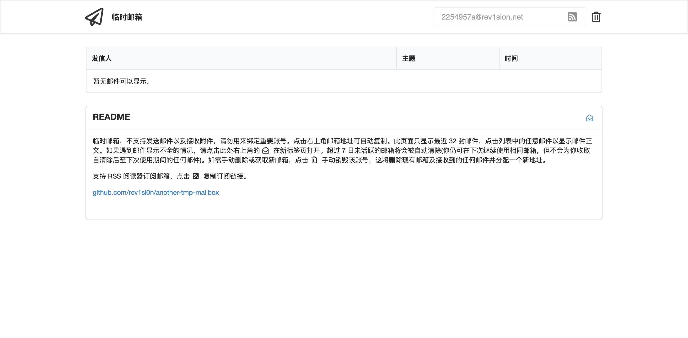

> 简单来说这还是造轮子，但是是因为我用别人轮子遇到了麻烦，一难调试二文档不全，虽然就几行配置，但是我是真的佩服就几行配置都难倒了我。跑起来了是跑起来了，但是工作是真的不正常。这里的阅后即焚目前来说是相对的，你需要手动清理。

无需注册，独立邮箱地址，支持富文本的邮件（html），支持 RSS 订阅，自动刷新，可手动删除账号。

好了我把链接贴上来 [denghongcai/forsaken-mail](https://github.com/denghongcai/forsaken-mail)，嗯就是它。
前端是直接偷的上面那个项目稍作修改我真不会前端[┑(￣Д ￣)┍]。 后端源代码稳定后再放上来，也就不到两百行。

### 这是干嘛的

当然我也得介绍这个东西到底是干什么的。比如你需要临时在一个网站注册账号，他需要你邮箱账号，这种情况下，我是不愿意使用我的真实邮箱去注册的，因为我不相信这个网站，其次我会尽量减少信息泄露的途径。又比如你在看xhz，要你注册账号才能下载，好了，用自己邮箱又是不太合适的地方。这时我一般会去找一些公开注册的网站新建一个邮箱。其实现成的服务挺多的，比如比较著名的 `yopmail` 就是一个类似的邮箱，你甚至不需要注册。

但是现在国内可以用邮箱注册账号的地方基本没有了，注册账号百分之99都需要手机号。而且国内对于邮箱的使用并不太流行，但是个人觉得这对我还是有用处的。

> 这个服务只能接收邮件并不能发送邮件。

因为垃圾邮件的的原因，目前所知的全球任何一家正规服务器提供商，默认都不会给你开放邮件端口的出网邮件。

### 如何自己部署

进行之前，请先确保云服务厂商允许25端口入站以及安全组/防火墙设置运行了25端口。
目前已知情况，阿里云的服务器默认25端口可以入站，所以你只需要将安全组设置运行25端口TCP即可。

随后，编辑要绑定域名的DNS解析记录，假设域名为 example.com
新建解析 (A)，主机记录 @，记录值填写为云服务器的IP。新建解析 (MX)，主机记录 @，记录值 example.com，MX优先级默认


例如如下配置，123.123.123.123 代表你的服务器IP，mail.example.com 是访问此邮箱页面的主机名，example.com 是邮箱的后缀例如 abcdef@example.com。


|主机记录|记录类型|记录值|TTL|
|  ----  | ----  | ----  | ----  |
|mail|CNAME|example.com|10分钟|
|@|MX|example.com|10分钟|
|@|A|123.123.123.123|10分钟|

这样，你已经完成了域名相关的配置，随后进入云服务器进行以下操作。

```bash
# cd 到源码文件夹
$ docker build -t tmpmail .
# 等待结束，随后自行修改下方 yaml 中的 domain 及相关端口配置
# 找到 ["python3", "-u", "/usr/local/tmpmail/main.py", "-port=8080", "-domain=YOUR.DOMAIN"]
# 将 8080 修改为你想要的端口（用来web访问），将 YOUR.DOMAIN 修改为你的域名，随后启动即可
$ docker-compose -f docker-compose.yaml up -d
```

### 演示截图:


Enjoy~
